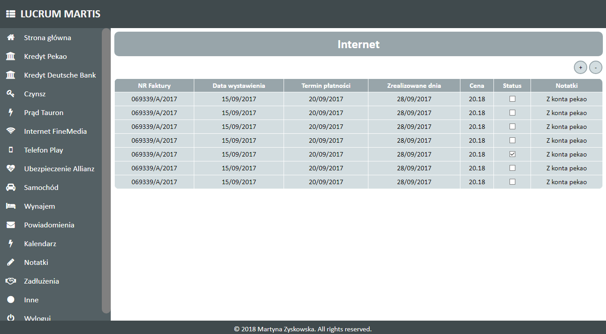

# Application: Finance
Finance application is a webpage project which contains all of your daily financial responsibilities in one place (loans, rent, bills etc.)
## Table of Contents
* [General info](#general-info)
* [Screenshots](#screenshots)
* [Technologies](#technologies)
* [Status](#status)
* [Code Examples](#code-examples)
* [Features](#features)
* [Contributing](#contributing)
* [License](#license)
* [Author](#author)
## General Info
The aim of the financial application is to 
- see all of your obligations, 
- order all of your obligations in the way that is best for you
- use the application on a daily, monthly or yearly basis
The end result is to have all of your financial obligations in one place.
## Screenshots

## Technologies
Project is created with:
- HTML5
- CSS3
- JS ES6
- PHP
## Status
Project is: _in progress_
## Code Examples

```
<?php include('header.php'); ?>

        <nav>
            <ul>
                <a href="index.php"><li><i class="fa fa fa-home"></i>Ogólne</li></a>
                <a href="kredyt-pekao.php"><li><i class="fa fa-bank"></i>Kredyt Pekao</li></a>
                <a href="kredyt-deutsche.php"><li><i class="fa fa-bank"></i>Kredyt Deutsche Bank</li></a>
                <a href="czynsz.php"><li><i class="fa fa-key"></i>Czynsz</li></a>
                <a href="prad-tauron.php"><li><i class="fa fa-flash"></i>Prąd Tauron</li></a>
                <a href="internet-finemedia.php"><li><i class="fa fa-wifi"></i>Internet Finemedia</li></a>
                <a href="telefon-play.php"><li><i class="fa fa-mobile-phone"></i>Telefon Play</li></a>
                <a href="ubezpieczenie-allianz.php"><li><i class="fa fa-heartbeat"></i>Ubezpieczenie Allianz</li></a>
                <a href="samochod.php"><li><i class="fa fa-car"></i>Samochód</li></a>
                <a href="wynajem.php"><li><i class="fa fa-bed"></i>Wynajem</li></a>
                <a href="powiadomienia.php"><li><i class="fa fa-envelope"></i>Powiadomienia</li></a>
                <a href="kalendarz.php"><li><i class="fa fa-tags"></i>Kalendarz</li></a>
                <a href="notatki.php"><li><i class="fa fa-pencil"></i>Notatki</li></a>
                <a href="#"><li><i class="fa fa-handshake-o"></i>Zadłużenia</li></a>
                <a href="inne.php"><li><i class="fa fa-info-circle"></i>Inne</li></a>
                <a href="wyloguj.php"><li><i class="fa fa-power-off"></i>Wyloguj</li></a>
            </ul>
        </nav>

        <section id="main">
            zadluzenia
            <article>
                test
            </article>

            <article>
                test
            </article>
        </section>

<?php include('footer.php'); ?>
```

## Features
#### List of features ready and TODOs for future development
* You can easily navigate under the categories

#### To-do list:
* main screen for every particular category
* using backend technologies to upload/modify/delete data from the external files placed on the local server
## Contributing
Contributions to the project library are welcome. Please note the following guidelines before submitting your pull request:
 - Follow [JS coding](https://developer.mozilla.org/bm/docs/Web/JavaScript/Guide) standards
 - Write tests for new functions and added featues
## License
MIT License: Copyright (c) 2018 Martyna Zyskowska
## Author
Martyna Zyskowska
